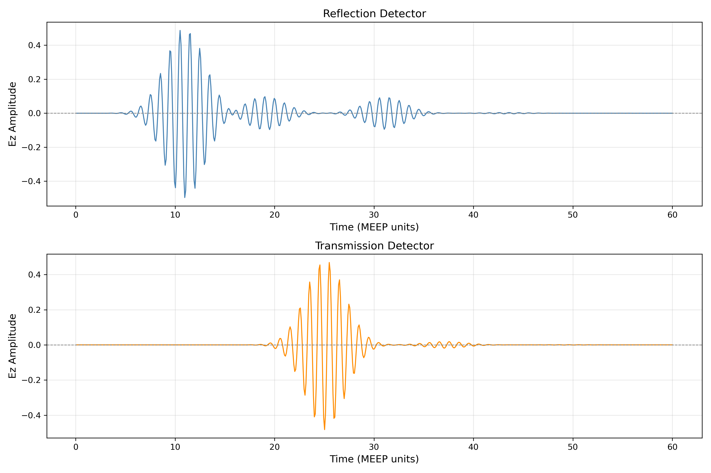
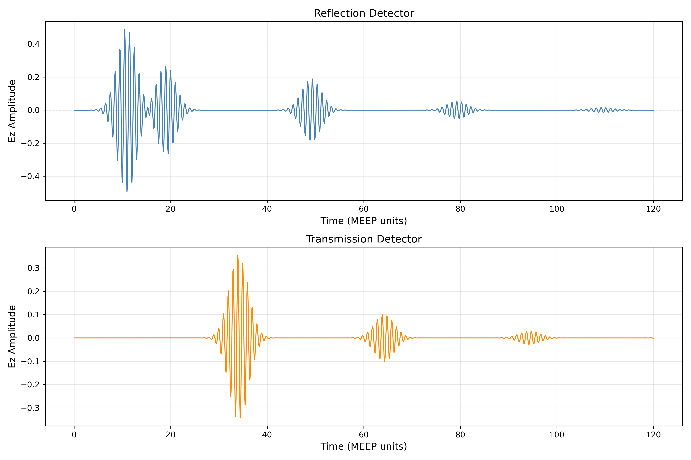

# Session 2: Gaussian Pulse in Dielectric Slab  
**Folder:** `00_em_simulations/02_dielectric_slab/`  
**Simulator:** MEEP FDTD

---
## What This Simulation is About
A Gaussian pulse of light is sent through a dielectric slab in a vacuum domain. Reflected and Transmitted field are recorded at detector points inside the domain. This is a beginner friendly MEEP EM simulation to understand the structure of a MEEP script, reflection and transmission of light, and delay caused by high refractive index medium.

### Why a dielectric slab?
In photonic integrated circuits, light is confined inside waveguide and other components based on refractive index contrast. Understanding how light behaves in a high refractive index medium helps one to in designing waveguides and other PIC components with better confinement.

---

## Output


The plot shows Ez field at *reflection detector* and *transmission detector* as a function of simulation time. Multiple envelopes can be observed in both the plots. The oscillations within the envelope represent the electric field cycles at 300 THz.  

In the **Reflection Detector** (at x = -6) plot, four envelops can be observed.
- `First Envelope` is the incident gaussian pulse generated by the source (at X = -7).
- `Second Envelope` is the field reflected at the vacuum-dielectric interface where the pulse enters the slab.
- `Third Envelope` is the field reflected at the dielectric-vacuum interface where the pulse exits the slab
- `Fourth Envelope` is the field reflected at the dielectric-Vacuum interface when the **reflection of third envelope** from vacuum-dielectric interface exits the slab.  

In the **Transmission Detector** (at X = +6) plot, two envelopes can be observed.
- `First Envelope` is the transmitted field of the original gaussian pulse.
- `Second Envelope` is the transmitted field when the *third envelope of reflected field* is reflected at the vacuum-dielectric interface.

The energy of each envelope can be seen decaying due through time. This is due to reflection at interface. This is explained by Fresnel Equation. The reflected power is 4% in this case.

```
r = (n1-n2)/(n1+n2)
r = (1.0-1.5)/(1.0+1.5) = -0.5/2.5 = -0.2

R=r^2
R = 0.04 = 4%
```
Hence, after the first reflection, only 96% power enters the slab. After the second reflection, 92.16% power reaches the transmission detector. 

---
## MEEP Script Structure  
Any MEEP script follows the same structure.
1. Define your `simulation parameters`
2. Define your `Source`
3. Define `Boundary Conditions`
4. Build the `simulation Object`
5. Define your `detector` and `detection function`
6. Run the simulation

---
## Script Explanation
### Import Libraries
```
import meep as mp
import numpy as np
import matplotlib
matplotlib.use('Agg')
import matplotlib.pyplot as plt
```

### Defining Simulation Parameters

```
resolution=32                   # Number of pixels per unit length
cell_size=mp.Vector3(20,0,0)    # Size of simulation Domain
```

Resolution controls the fitness of spatial grid. The rule of thumb is:
```
resolution >= 8 x center_frequency x n_max     (minimum)
resolution = 16 x center_frequency x n_max    (standard)
``` 
`Note:` Below 8 x n_max pixel per wavelength, the program itself distorts the wave which does not hold any physical meaning.

###  Defining Geometry

```
slab_thickness = 4.0
slab_epsilon = 2.25

geometry = [
    mp.Block(
        size=mp.Vector3(slab_thickness,mp.inf,mp.inf),
        center=mp.Vector3(0,0,0),
        material=mp.Medium(epsilon=slab_epsilon)
    )
]
```
The `Block` method in MEEP is used to create slab structures.  
The mp.Block() method tales three parameters:
- *size*: Dimension of the slab in x, y and z axis. 
- *center*: Coordinate of center of the block.
- *material*: should be defined using `mp.Medium()` method. Here, epsilon = n^2

### Defining Source

```
fc = 1.0
fwidth = 0.5

sources = [
    mp.Source(
        mp.GaussianSource(
            frequency = fc,
            fwidth = fwidth
        ),
        component = mp.Ez,
        center = mp.Vector3(-7, 0, 0)
    )
]
```

###  Defining Boundary Condition

```
pml_layers=[mp.PML(thickness = 1.0)]
```

###  Defining Simulation Object

```
sim = mp.Simulation(
    cell_size = cell_size,
    boundary_layers = pml_layers,
    sources = sources,
    geometry = geometry,
    resolution = resolution
)
```

###  Defining Detectors
Since we are simulating the behavior of gaussian pulse in a dielectric slab, both transmitted and reflected fields are to be monitored.  

```
reflection_detector = mp.Vector3(-6,0,0)
transmission_detector = mp.Vector3(6,0,0)

reflection_data = []
transmission_data = []

def record_reflection(sim):
    ez = sim.get_field_point(mp.Ez, reflection_detector)
    reflection_data.append( (sim.meep_time(),ez) )

def record_transmission(sim):
    ez=sim.get_field_point(mp.Ez,transmission_detector)
    transmission_data.append( (sim.meep_time(), ez) )
```

###  Run the Simulation
To run the simulation, we use the `run()` method and call the `at_every()` method to record the field component as per our detector function.

```
print("\n Starting the Simulation")

sim.run(
    mp.at_every(0.1,record_reflection),
    mp.at_every(0.1,record_transmission),
    until = 60
)

print("\nSimulation Completed")
```

###  Extracting Data

```
refl_time = np.array([t for t,_ in reflection_data])
refl_ez = np.real(np.array([ez for _,ez in reflection_data]))

trans_time = np.array([t for t,_ in transmission_data])
trans_ez = np.real(np.array([ez for _,ez in transmission_data]))
```

###  Plotting Results

```
fig, (ax1,ax2) = plt.subplots(2,1,figsize=(12,8))

#--------------Reflection Plot------------------#
ax1.plot(refl_time, refl_ez, color="steelblue", linewidth=1.2)
ax1.axhline(0, color="gray", linewidth=0.8, linestyle='--')
ax1.set_xlabel('Time (MEEP units)', fontsize=12)
ax1.set_ylabel('Ez Amplitude', fontsize=12)
ax1.set_title('Reflection Detector',fontsize=13)
ax1.grid(True, alpha=0.3)

#--------------Transmission Plot------------------#
ax2.plot(trans_time, trans_ez, color="darkorange", linewidth=1.2)
ax2.axhline(0, color="gray", linewidth=0.8, linestyle='--')
ax2.set_xlabel('Time (MEEP units)', fontsize=12)
ax2.set_ylabel('Ez Amplitude', fontsize=12)
ax2.set_title('Transmission Detector', fontsize=13)
ax2.grid(True, alpha=0.3)

plt.tight_layout()
plt.savefig("s02_op.png", dpi=300)
print("\nOutput Plot Saved to Outputs directory")
```

---
## Observations
### Epsilon
Increasing epsilon the of material to `12.25` makes the slab act as a _**Si** slab_ (n = 3.5).  


The following pulses can be observed in the graph:
- Reflection detector,
    - `first` - incident pulse from the source
    - `second` - reflection of `first` while entering the slab
    - `third` - reflection of the `first` while leaving the slab
    - `fourth` - reflection of the reflection of `third` while leaving the slab
- Transmission Detector,
    - `first` - transmission of the incident pulse from the source
    - `second` - transmission of the reflection of `third` reflection
    - `third` - transmission of the reflection of `fourth` reflection  

These changes are observed in [s02_op_Si.png](outputs/s02_op_Si.png) due to the following reasons:  
- The reflected power is increased as the fresnel loss percentage is `30.8%`.  
- The pulse is delayed more at the slab, than [s02_op.png](outputs/s02_op.png) due to higher refractive index.

---
## Key Parameters
| Parameter | Value | Physical Meaning |
| ------- | ------- | ------- |
| `resolution` | 32 | 32 grid points per µm |
| `cell_size` | (20,0,0) | 20 µm x 1D domain |
| `fc` | 1.0 | 300 THz, near-infrared |
| `fwidth` | 0.5 | Pulse bandwidth |
| PML thickness | 1.0 | 1 µm absorbing boundary|
| Source position | (-7,0,0) | 2 µm from left PML |
| Reflection Detector position | (-6,0,0) | 3 µm from left PML|
| Transmission Detector position | (+6,0,0) | 3 µm from right PML|